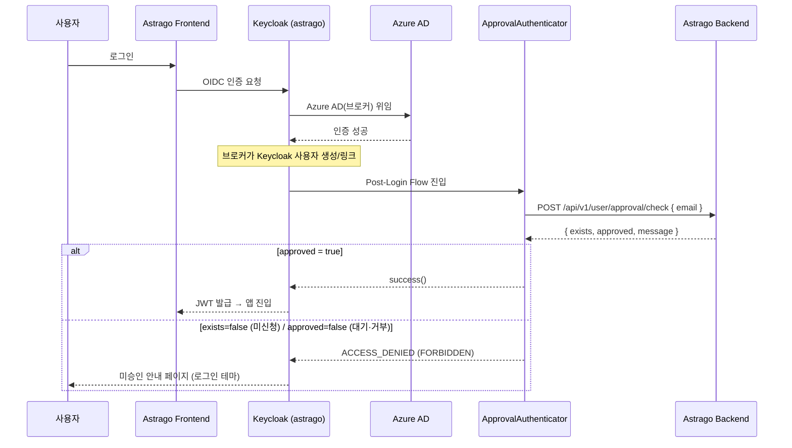

# astrago-doosan-enb-spi

두산에너빌리티 Astrago용 Keycloak 커스텀 SPI (Kotlin).

Azure AD SSO 로그인 후 **Astrago 백엔드의 승인 상태를 확인해 미승인 사용자의 로그인을 차단**하는
승인 게이트 Authenticator를 제공한다.

> 설계 배경/전체 흐름: Obsidian `두산에너빌리티/커스텀 기능/권한관리 & 워크스페이스/2. Azure SSO 승인 게이트 설계` 참고.
> 관련 Linear: AST-7721(SSO 연동), AST-7695(HTTPS 전환).

---

## 구성

| Provider | ID | 역할 |
|---|---|---|
| `ApprovalAuthenticator` | `astrago-doosan-approval-check` | Post-Login Flow에서 승인 상태 확인 후 차단/허용 |

- 언어/빌드: **Kotlin + Gradle (Kotlin DSL)**, **JVM 21 타겟** (Keycloak 런타임 = Java 21 LTS)
- Keycloak: **23.0.7** (`compileOnly`), keycloakx 이미지 런타임 **OpenJDK 21** — ⚠️ Keycloak/JVM 버전 변경 시 `build.gradle.kts` 타겟도 함께 맞출 것 (타겟 > 런타임이면 로드 실패)
- 외부 런타임 의존성 없음 (JDK `HttpClient` + Keycloak 내장 Jackson) → **shade 불필요, 가벼운 jar**

## 인증 흐름



- 게이트는 **Post-Login Flow**(IdP 단위)에서 끊으므로, 미승인 사용자는 **토큰 자체를 못 받는다** → 미승인 안내는 Next.js 앱이 아니라 **Keycloak 로그인 테마**가 렌더.
- 백엔드 연결 실패/타임아웃 시 `exists=false` 로 처리(**fail-closed**) → 차단.

## 백엔드 API 계약 (필요)

SPI는 아래 엔드포인트를 호출한다. (백엔드 구현 완료 — `astrago-backend-v2-doosan-enb`)

```
POST {backend.api.url}/api/v1/user/approval/check   # 인증 불필요(permitAll) + 서명/IP 제한 권장
Content-Type: application/json
{ "email": "user@doosan.com" }                       # 이메일은 본문으로 전달(URL/로그 PII 노출 방지)

200 OK
{
  "exists":   true,    // 승인 대상(sso_account_approval)에 존재
  "approved": false,   // approval_status == APPROVED
  "message":  "계정 승인 대기 중입니다."
}
```

| exists | approved | 결과 |
|---|---|---|
| false | - | 차단 — "승인 미신청" 안내 |
| true | false | 차단 — "승인 대기/거부" 안내 |
| true | true | **로그인 허용** |

## 설정 옵션 (Authenticator Config)

Admin Console 의 step ⚙️ 에서 설정한다 (`ApprovalAuthenticatorFactory`).

| Key | 라벨 | 설명 | 기본값 |
|---|---|---|---|
| `backend.api.url` | Backend API URL | 승인 상태를 조회할 Astrago 백엔드 기본 URL (클러스터 내부 서비스) | _(빈값 — 필수 입력)_ |
| `error.message` | 승인 대기/거부 메시지 | `approved=false` 사용자에게 표시 | `계정 승인 대기 중이거나 거부되었습니다. 관리자에게 문의하세요.` |
| `pending.message` | 승인 미신청 메시지 | `exists=false` 사용자에게 표시 | `승인 신청이 필요합니다. Service Navigator를 통해 계정 승인을 신청해주세요.` |

- `backend.api.url` 미설정 시 Authenticator 는 `INTERNAL_ERROR` 로 실패한다(설정 필수).
- 예) `http://astrago-backend-core.astrago.svc.cluster.local:<port>` — 외부 URL 아님.

## 빌드

```bash
./gradlew build
# 산출물: build/libs/astrago-doosan-enb-spi-1.0.0.jar
```

## 배포 (두산 오프라인 클러스터)

Keycloak(quarkus)은 `/opt/keycloak/providers/` 의 jar 를 기동 시 `kc.sh build` 로 등록한다.
두산 keycloakx 는 **커스텀 이미지 `xiilab/astrago-keycloak-theme`**(로그인 테마 포함)를 쓰고, 차트 `args`
가 기동마다 `kc.sh build && kc.sh start --optimized` 를 돌린다. → **이 이미지에 SPI jar 를 구워 넣으면
자동 등록**된다.

> **docker 불필요.** 빌드 = **buildah**, 오프라인 반입 = **skopeo + `images/images_list.txt`**.

### 1) SPI jar 빌드
```bash
./gradlew build      # → build/libs/astrago-doosan-enb-spi-1.0.0.jar
```

### 2) keycloak-theme 이미지에 jar 번들 — `astrago-login-theme` 레포
이미지 빌드 정의(Dockerfile/Containerfile)에 한 줄 추가하고 태그를 올린다(예: `doosan-enb-1.0.3` → `1.0.4`).
```dockerfile
COPY astrago-doosan-enb-spi-1.0.0.jar /opt/keycloak/providers/
```
```bash
buildah bud -t docker.io/xiilab/astrago-keycloak-theme:doosan-enb-1.0.4 .
buildah push docker.io/xiilab/astrago-keycloak-theme:doosan-enb-1.0.4
```

### 3) 오프라인 Harbor 미러 — `astrago-deployment-v2`
`images/images_list.txt` 의 keycloak-theme 항목을 새 태그로 갱신:
```text
docker.io/xiilab/astrago-keycloak-theme:doosan-enb-1.0.4   # [essential]
```
→ `k0s/scripts/pull_images.sh`(skopeo, 인터넷측 tar) → SCP → `push_images.sh`(skopeo → Harbor)

### 4) helm 태그 반영 후 재배포
`astrago.keycloak.tag` 를 새 태그로 변경(`offline.registry` 가 Harbor 로 치환됨) 후:
```bash
cd /DATA/astrago-deployment-v2/helmfile
helmfile -l name=keycloakx apply     # keycloakx 롤링 재시작 → kc.sh build 가 SPI 등록
```

### 5) Flow 설정 (Admin Console)
1. Authentication → Flows → 새 플로우(예: `post-login-approval`) 생성
2. **Add step → "Astrago Doosan-ENB 사용자 승인 확인"** 추가, Requirement = **Required**
3. step ⚙️ 설정:
   - **Backend API URL**: 클러스터 내부 서비스 (예: `http://astrago-backend-core.astrago.svc.cluster.local:<port>`)
   - 승인 대기/거부 · 미신청 메시지 (선택)
4. Identity Providers → **Microsoft** → Advanced → **Post Login Flow** = `post-login-approval`

### 검증 / 롤백
```bash
kubectl logs -n astrago keycloakx-0 -c keycloak | grep -i "providers\|approval"
# Admin Console 의 Add step 목록에 "Astrago Doosan-ENB 사용자 승인 확인" 보이면 등록 성공
```
- 롤백: 해당 step 을 **Disabled** 로 바꾸거나 IdP 의 Post Login Flow 연결 해제 → 즉시 게이트 해제(재배포 불필요)

> [!warning] 순서 — SPI 는 fail-closed
> 백엔드 `POST /api/v1/user/approval/check` 가 **먼저** 떠 있어야 한다. 없으면 백엔드 연결 실패 → `exists=false`
> → **전원 차단**. 따라서: 백엔드 API → SPI 이미지 배포 → (flow 는 Disabled 유지) → 백엔드 확인 후 Required 로 ON.

## CI / Release (GitHub Actions)

`.github/workflows/release.yml` — **`main` 브랜치 push 시 자동**으로:

1. JDK 21(temurin) + Gradle 셋업 (wrapper 검증·캐시)
2. `./gradlew clean build`
3. `build.gradle.kts` 의 `version` 추출 → 동일 `vX.Y.Z` 태그 없으면
4. **GitHub Release 생성** (jar 첨부, 자동 릴리스 노트) + 빌드 아티팩트 업로드

> 새 버전 릴리스 = `build.gradle.kts` 의 `version` 값을 올리고 `main` 에 push.
> (런타임 정합을 위해 CI 빌드 JDK 는 **21** 로 고정)

산출물 `astrago-doosan-enb-spi-<version>.jar` 는 Release 에서 받거나 직접 빌드해, 위 배포 절차대로
`astrago-keycloak-theme` 이미지에 번들한다.

## 동작 원칙

게이트는 "순서"가 아니라 **현재 승인 상태**만 확인한다(idempotent). 사용자가 승인 전에 먼저
로그인해도 미승인 페이지만 보일 뿐 깨지지 않으며, 승인 후 재로그인하면 통과한다.

## 향후 (Phase 2)

- Service Navigator 승인 callback 연동 (SR 승인 → 백엔드 승인 상태 반영)
- (선택) Custom Mapper Provider 추가 — IdP attribute 매핑을 코드로 고정해 수동 매퍼 취약점 제거
